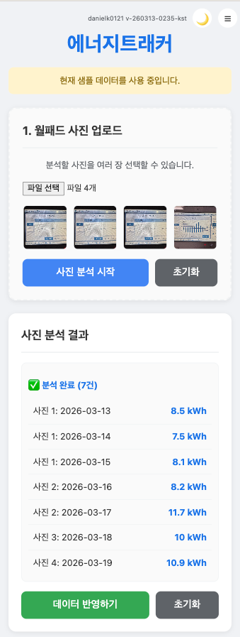
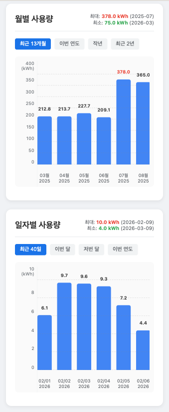
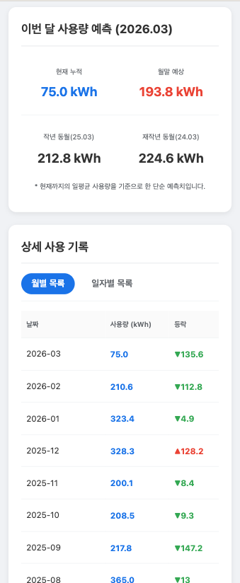

# 에너지 트래커 (energytracker)

아파트 월패드의 전기 사용량 데이터를 사진 촬영을 통해 간편하게 디지털 데이터로 변환하고, 모바일에서 차트로 관리할 수 있는 애플리케이션입니다.

## 📋 프로젝트 배경
- **문제점**: 아파트 월패드에서 제공하는 전기 사용량 데이터는 접근성이 낮고(터치 성능 저하), 모바일 연동이 되지 않아 이력 관리가 어렵습니다.
- **해결책**: 월패드 화면을 사진으로 찍어 올리면, 데이터를 자동으로 추출하여 모바일에서 언제든 차트로 확인할 수 있게 합니다.

## 🚀 주요 기능 및 시나리오
1. **사진 업로드**: 월패드에 표시된 전기 사용량 수치나 차트 화면을 사진으로 촬영하여 앱에 업로드합니다.
2. **데이터 추출 (OCR/분석)**: 업로드된 이미지에서 날짜별/시간별 전기 사용량 데이터를 자동으로 추출합니다.
3. **사용량 시각화**: 추출된 데이터를 기반으로 일자별, 월별 사용 추이를 차트로 보여줍니다.
4. **이력 관리**: 과거 사용 데이터를 보관하여 전기 요금을 예측하거나 절약 계획을 세울 수 있도록 돕습니다.

## 🗺 개발 로드맵
- [ ] **Phase 1: 웹 프로토타입 개발**
    - 기본적인 데이터 입력 및 시각화 UI 구현
    - 모바일 웹 최적화 레이아웃 구성
- [ ] **Phase 2: OCR 기능 추가**
    - 이미지 분석 엔진 연동 (Tesseract.js 등)
    - 월패드 화면 특화 데이터 추출 알고리즘 개발
- [ ] **Phase 3: 안드로이드 앱 개발**
    - 카메라 연동 및 네이티브 기능 강화
    - 푸시 알림 (요금 목표 달성 등) 기능 추가

## 🛠 기술 스택 (예정)
- **Frontend**: React (TypeScript) / Mobile-friendly Web
- **Backend**: Node.js (Express) or Python (FastAPI)
- **Image Analysis**: Tesseract.js / Google Cloud Vision 등
- **Charts**: Chart.js / Recharts

## 💡 아키텍처 방향성
### 데이터 저장소
- 데이터베이스(DB) 대신 개인 클라우드 저장소를 활용하는 방안을 우선적으로 고려합니다.
- 개인 정보 보호 및 유지보수 편의를 위해 되도록 별도의 중앙 DB를 사용하지 않는 방향을 지향합니다.

### 사진 분석 기술
- 클라이언트 사이드에서 JavaScript만으로 동작하는 OCR(Tesseract.js 등) 기술 활용을 권장합니다.
- 정교한 분석을 위해 LLM AI 서비스가 필요할 경우 도입을 검토하되, 이 경우 API 키 보안을 위해 백엔드 서버 구축이 병행되어야 합니다.

## 스크린샷

---

*현재 Phase 1: 웹 프로토타입 단계가 진행 중입니다.*
